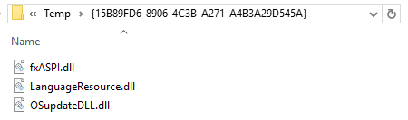

# Patching the fx-CP400 firmware
This isn't a fun process at the moment, but it works. Hopefully, in the future, this process will be easier - but it isn't yet. If you run into any serious trouble, reach out to me on [Twitter](http://twitter.com/The6P4C) or [Reddit](http://reddit.com/u/The6P4C) and I *may* be able to help you out. 

You need both a Windows and Linux machine to complete this process (as there is no updater for Linux, and the extraction tool extracts the firmware from the Windows DLLs). I'd recommend a virtual machine (or Vagrant box for simplicity) rather than two physical machines.

You'll also need a resource editor program - [Resource Hacker](http://www.angusj.com/resourcehacker/) has been tested to work (Visual Studio can also be used to replace the RCDATA resource - just be careful to give the replaced resource an ID of 3070!).

## 0. Clone this repository
Clone this repository onto your machine. If you're using a virtual machine, this is really great place to use the shared folders feature your VM host probably provides.

## 1. Build an SH4 cross-compiler
Hop onto your Linux machine.

First, you'll have to define a few environment variables to ensure the process goes smoothly. Feel free to change `PREFIX` (the installation location), but don't change `TARGET`.

```sh
# folder to install our cross-compiler into
export PREFIX="$HOME/opt/cross"

# the architecture and executable format we're targeting
export TARGET=sh4-elf

# add the cross-compiler to our PATH
# you'll probably want to put this somewhere like .bash-profile or .bashrc
export PATH="$PREFIX/bin:$PATH"
```

Now, download the most recent stable version of the Binutils source code from the [Binutils website](https://gnu.org/software/binutils/). Extract the compressed file containing the source code into a directory, and `cd` into the newly created directory. Then, run these commands inside that directory.

```sh
mkdir build
cd build
../configure --target=$TARGET --prefix="$PREFIX" --with-sysroot --disable-nls --disable-werror
make
sudo make install
```

You'll now have tools such as `sh4-elf-as` and `sh4-elf-objcopy` available.

Now, download the most recent stable version of the GCC source code from the [GCC website](https://gnu.org/software/gcc/). Extract the compressed file containing the source code into a directory, and `cd` into the newly created directory. Then, run these commands inside that directory. Be warned - the `make` commands may take a long time, depending on your system, and the `contrib/download_prerequisites` script will download about 30 MB of archives.

```sh
contrib/download_prerequisites
mkdir build
cd build
../configure --target=$TARGET --prefix="$PREFIX" --disable-nls --enable-languages=c,c++ --without-headers
make all-gcc
make all-target-libgcc
sudo make install-gcc
sudo make install-target-libgcc
```

You’ll now have `sh4-elf-gcc` and `sh4-elf-g++` available for your usage.

## 2. Build the patches
Keep working on your Linux machine.

`cd` into the `patches/` directory. Run `make`.

## 3. Harvest the firmware updater
Download the latest firmware update ZIP file from the [CASIO website](http://edu.casio.com/products/cg/cp2/). Run the installer inside the ZIP, but don't move through any of the steps. Leave it open.

Now, open your user's `AppData` folder and search for `OSupdateDLL.dll`. One result should appear - open the folder it's contained in. It should contain the files `OSupdateDLL.dll`, `fxASPI.dll` and `LanguageResource.dll`.



Copy all three of these files into a temporary directory somewhere on your system. You can close the installer now.

## 4. Extract, patch, pack and embed the firmware image
Move to either your Windows or Linux machine (whichever you have Python installed on).

Inside the temporary directory containing the DLLs you harvested, run the following commands. Replace `<hollyhock_path>` with the path to where you cloned this repository.

```sh
# extract the two firmware images (3069: bootloader, 3070: main OS)
python <hollyhock_path>/tools/hollyhock.py extract OSupdateDLL.dll fw3069.bin fw3070.bin
# patch the main OS firmware image
python <hollyhock_path>/tools/hollyhock.py patch <hollyhock_path>/patches/ fw3070.bin patched_fw3070.bin
# pack the patched firmware image ready to be embedded in the DLL
python <hollyhock_path>/tools/hollyhock.py pack patched_fw3070.bin packed_fw3070.bin OSupdateDLL.dll
```

Copy the `OSupdateDLL.dll` file to something new (maybe `patched_OSupdateDLL.dll`!) and open it in your resource editor. Replace the 3070 resource with your packed 3070 image.


## 5. Run the updater
Don't connect your calculator to your PC yet.

On your Windows machine and in the temporary directory you've been working in, open the command prompt and run the following command.

```
<hollyhock_path>\tools\run_update.bat patched_OSupdateDLL.dll
```

When the updater opens, hold the `[EXP]`, `[^]` and `Clear` keys on your fx-CP400. With those keys depressed, momentarily press the `RESET` button on the back of the calculator (hint: use the stylus!). Keep the three front buttons depressed until the LCD displays the following:

```
*****************
*    OS ERROR   *
* Please update *
*       OS      *
*****************
```

Release the buttons and connect the calculator to your PC using a USB cable. Proceed through the OS updater, and disconnect your calculator **only** once the update has finished.

## 6. Check the patch
Turn on your calculator and confirm the patch was applied correctly by opening the version dialog (either from the settings menu in the top left corner of Main > Version, or in System) and confirming the string "hollyhock" is displayed.

## 7. Build the launcher
`cd` into the `launcher/` directory. Run `make`, then copy the file `run.bin` into the root directory of your GC's flash.

## 8. Celebrate!
You've successfully patched your fx-CP400's firmware, and installed the Hollyhock Launcher. You're ready to go!

You can now start [using](using.md) or [developing](developing.md) software for your GC.
